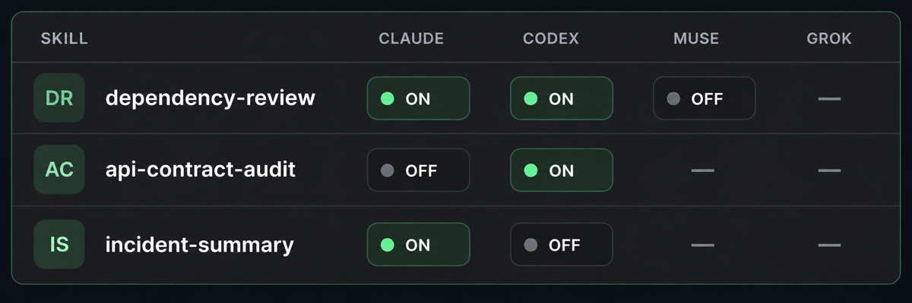

<picture>
  <source media="(prefers-color-scheme: dark)" srcset="./assets/profile-accent-dark.svg">
  <source media="(prefers-color-scheme: light)" srcset="./assets/profile-accent-light.svg">
  
</picture>

# Piotr Krawczyk

**Principal Software Engineer · Mobile Apps · AI Tools and Systems**

I build mobile apps, developer tools, and software that uses AI. I work on
automation and workflows for AI agents. Android and Kotlin are my strongest
skills. I also build backend systems, connect apps to APIs, and improve
existing software.

## Selected work

### [Skill Manager](https://github.com/dees91/agent-skill-manager)

A macOS app, TUI, and CLI to manage skills for AI coding tools. You can turn
skills on or off without deleting them.

[Download macOS app](https://github.com/dees91/agent-skill-manager#quick-start) ·
[Repository](https://github.com/dees91/agent-skill-manager)

### [RFID Store Simulator](https://github.com/dees91/rfid-store-simulator)

A 3D store for testing RFID apps without a real scanner. It includes a BLE
scanner emulator.

[Watch demo](https://github.com/dees91/rfid-store-simulator#readme) ·
[Repository](https://github.com/dees91/rfid-store-simulator)

**[Koin scope bug](https://github.com/dees91/KoinIssue2379)** — a small Android
app that shows a bug after updating Koin.

## Links and contact

[deesoft.pl](https://deesoft.pl/en/) ·
[LinkedIn](https://www.linkedin.com/in/piotr-krawczyk-engineer/) ·
[Stack Overflow](https://stackoverflow.com/users/3889402/dees91)

Email: [contact@deesoft.pl](mailto:contact@deesoft.pl)
